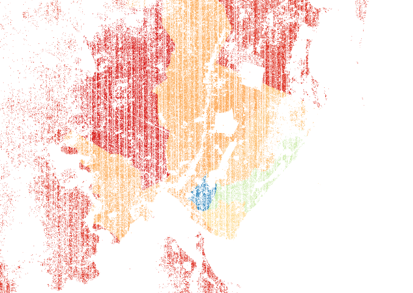
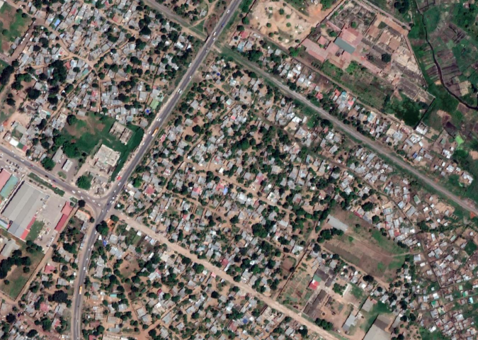
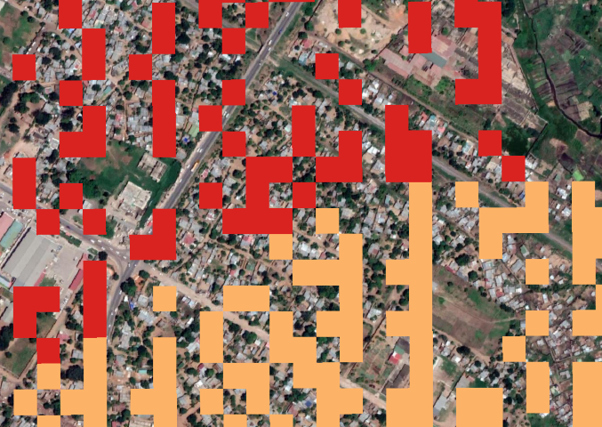
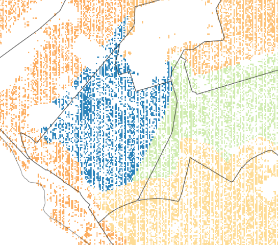

# Maputo-Population

Describe population estimate method

### Data
HRSL
OSM buildings
INE Census data
Morphological areas

### Existing population data
There are two main sources for population data in the Greater Maputo.
First of all there are available dataset of *INE - Instituto Nacional de Estatistica*. Open Data of the IV General Census of Population and Housing, 2017. The main problem for the dataset is the low resolution, infact the data are aggregated per province or for district (just for Maputo city).
The second sources is *HRSL - High Resolution Settlement Layer*. This layer is made by Facebook using AI and 2016 satellite images to identify populated areas. Resolution of 30x30 meters whether or not there is a building. Then CIENIS process this data, with data from INE 2007 applying growth rate to estimate population per HRSL pixel.

> CIESIN used proportional allocation to distribute population data from subnational census data to the settlement extents.
(CIESIN - https://ciesin.columbia.edu/data/hrsl/)

> Adjustments to match the census population with the UN estimates are applied at the national level. The UN estimate for a given country (or state/territory) is divided by the total census estimate of population for the given country. The resulting adjustment factor is multiplied by each administrative unit census value for the target year. This preserves the relative population totals across administrative units while matching the UN total.

Also this second sources has a very low resolution considering the scale we are dealing with.

Moreover two problems:

No more resolution than INE

Not correct boundaries (considering the working scale)

### Estimate population method

Image with the result. For our work the detail of those data very useful considering HRSL (pixel 30m per 30m), but absolutely inconsistence for the population estimated. Columbia university applied census data to hrsl.
So we developed something very similar, but considering updated CENSUS data and weighting the result in order to give more detail.

HRSL identify wether or not there is a building. It not consider if there is just one building or many buildings inside. For sure, for one HRSL pixel exist at least one building

Consider buildings from OSM and Google maps. OSM very precise just in small areas, where they are mapped. Google low precision, but wider areas. Much more precision in periphery (exactly the opposite of OSM).

Consider the division into morphological areas.

DENSITY: Count the number of HRSL pixel for each area. Count the number of buildings for each areas, both for OSM and Google maps sources. Manually for each area, we decided the reliability about buildings data. In some area OSM much more precise, in other Google maps, in still other none.

DENSITY 2: Buildings/HRSL (must be >= 1). To calculate this density we used OSM buildings or Google buildings where they are reliable - correct.
In the case where both are wrong or absents - the number of buildings is estimated as the minumum value buildings per HRSL of the same morphological class (at least 1).

RESIDENTIAL BUILDINGS. Excluding of industrial buildings.

Population per district from INE (2017 Census data)

Buildings per district (estimated - sum of buildings from morphological area in the same district)

I can easily estimate Pop / buildings.
I can easily estimate the Pop for each area.

NO, following has no sense: Can I refine the data considering average people/buildings in the district? By now has been considered homogeneous. No sense!

## References
Bonafilia, D., Kirsanov, D., Gill, J., & Sundram, J. (2019, April 09). Mapping the world to help aid workers, with weakly, semi-supervised learning. Retrieved from Facebook Artificial Intelligence: https://ai.facebook.com/blog/mapping-the-world-to-help-aid-workers-with-weakly-semi-supervised-learning

Tiecke, T. (2016, Novembar 15). Open population datasets and open challenges. Retrieved from Facebook Engineering: https://engineering.fb.com/connectivity/open-population-datasets-and-open-challenges/

Facebook Connectivity Lab and Center for International Earth Science Information Network - CIESIN - Columbia University. 2016. High Resolution Settlement Layer (HRSL). Source imagery for HRSL © 2016 DigitalGlobe. Accessed 03 June 2020.
